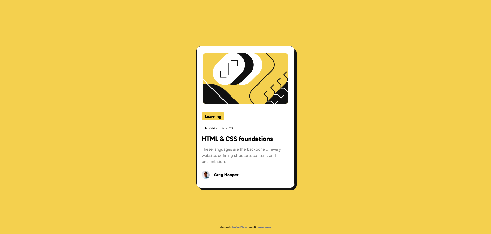

# Frontend Mentor - Blog preview card solution

This is a solution to the [Blog preview card challenge on Frontend Mentor](https://www.frontendmentor.io/challenges/blog-preview-card-ckPaj01IcS). Frontend Mentor challenges help you improve your coding skills by building realistic projects. 

## Table of contents

- [Overview](#overview)
  - [The challenge](#the-challenge)
  - [Screenshot](#screenshot)
  - [Links](#links)
- [My process](#my-process)
  - [Built with](#built-with)
  - [What I learned](#what-i-learned)
  - [Continued development](#continued-development)
- [Author](#author)

## Overview

### The challenge

Users should be able to:

- See hover and focus states for all interactive elements on the page

### Screenshot



### Links

- Solution URL: [https://github.com/jdgarcia277/frontend-blog-preview-card](https://github.com/jdgarcia277/frontend-blog-preview-card)
- Live Site URL: [https://jdgarcia277.github.io/frontend-blog-preview-card/](https://jdgarcia277.github.io/frontend-blog-preview-card/)

## My process

### Built with

- Semantic HTML5 markup
- CSS custom properties
- Flexbox
- Mobile-first workflow

### What I learned

The hardest part of this build to me, was the challenge of scaling the text without media queries. I decided to go with this line of code.
```css
font-size: clamp(14px, calc(14px + (2 * (100vw - 375px) / 1065)), 16px);
```
This line was placed in my root so that if the font size scaled rem would also scale which would help with the responsiveness of my site. 

###### How does this work? (the most important question)
Clamp takes a min value, preferred value, and max value. The min value I needed for my font size was 14px with the maximum being 16px. The preferred or middle section is the most complicated in which it needs a dynamic value that scales until it reaches 16px. To do this I used a calc function. Lets break down the portions of the calc function.

- (2 * (100vw - 375px) / 1065))
  - 375px is subtracted from 100vw to calculate how much the viewport width has increased from the base 375px. This gives the difference in width.
  - The total change in viewport width is 1065px (1440px - 375px). These values are pulled from the style guide.
  - The difference in viewport width (100vw - 375px) is divided by 1065 to normalize it to a scale of 0 to 1 (0 when the viewport is 375px, 1 when the viewport is 1440px).
  - The maximum change in font size needed is 2px (16px - 14px).
  - The change in viewport is multiplied by 2 to scale it up to the desired maximum change in font size.

Finally, this scaled value is added to the base font size 14px to produce the responsive font size.

### Continued development

I would like to continue improving on all my skills. I feel I could find more efficient ways to code things and learn best practices. I am self taught, so best practices are best learned by feedback and watching how more experienced developers structure their code.

## Author

- Frontend Mentor - [@jdgarcia277](https://www.frontendmentor.io/profile/jdgarcia277)
- GitHub - [@jdgarcia277](https://github.com/jdgarcia277)
